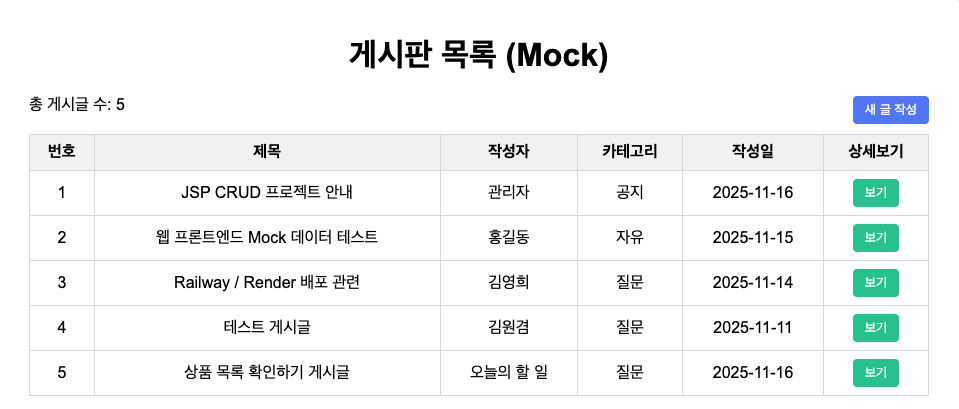
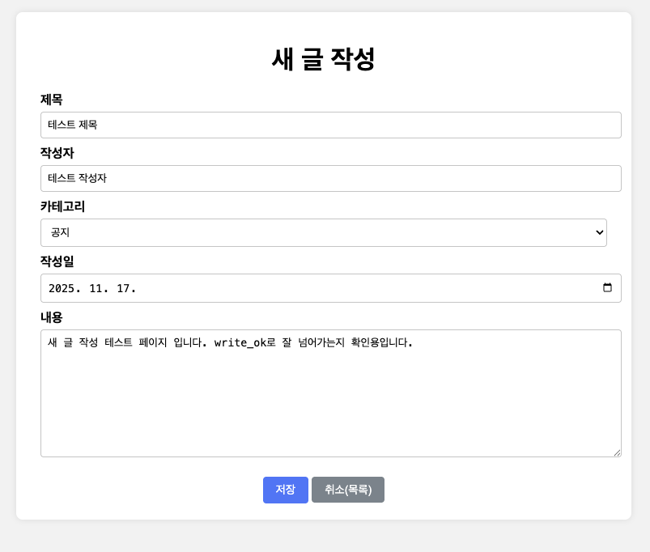
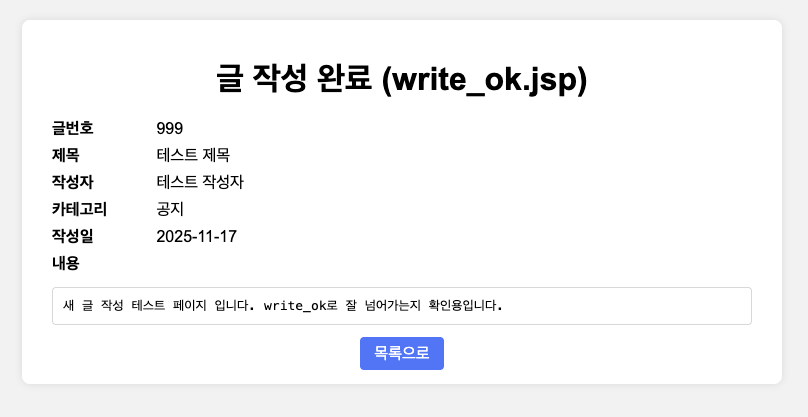
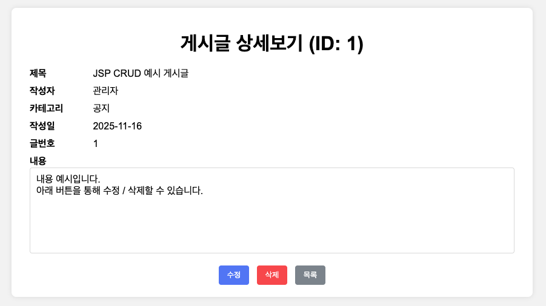
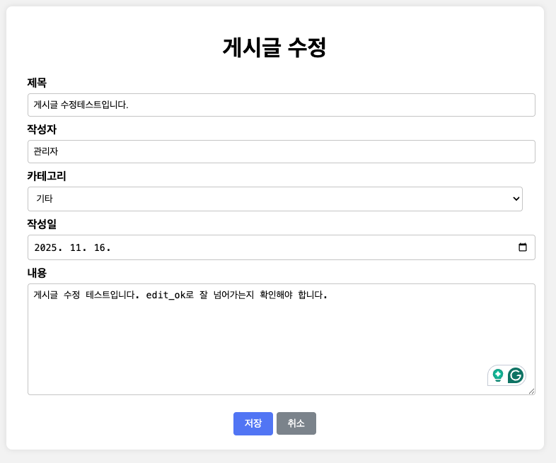
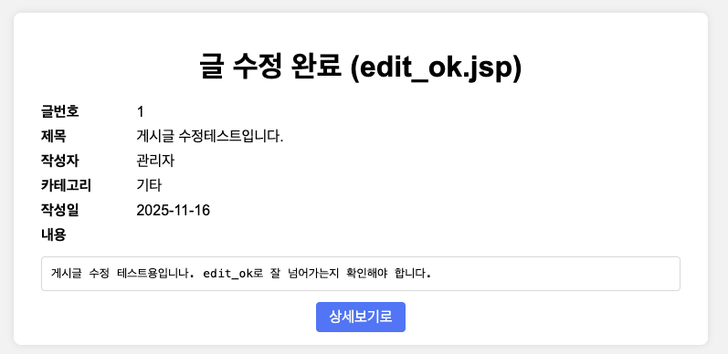
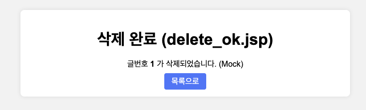

--

##  주요 기능 

---

## 1.  목록보기 — `list.jsp`

---

## 2. 새 글 작성 — `write.html`

---

## 3.  글 작성 결과 — `write_ok.jsp`

---

## 4.  상세보기 — `view.jsp`

---

## 5.  수정 화면 — `edit.html` / 

---

## 6.  수정 결과 — `edit_ok.jsp`

---

## 7.  삭제 결과 — `delete_ok.jsp`

---
